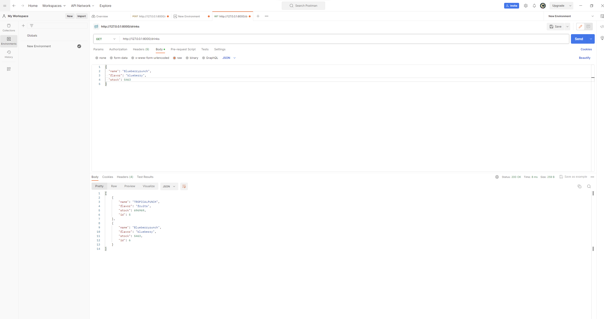
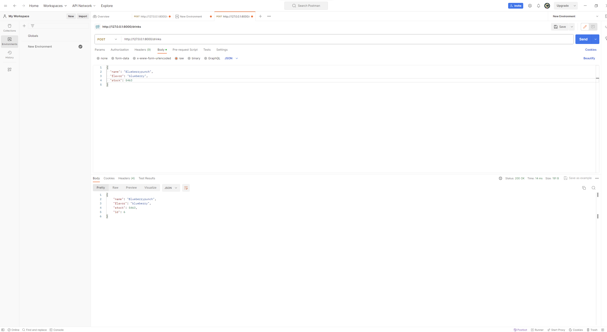
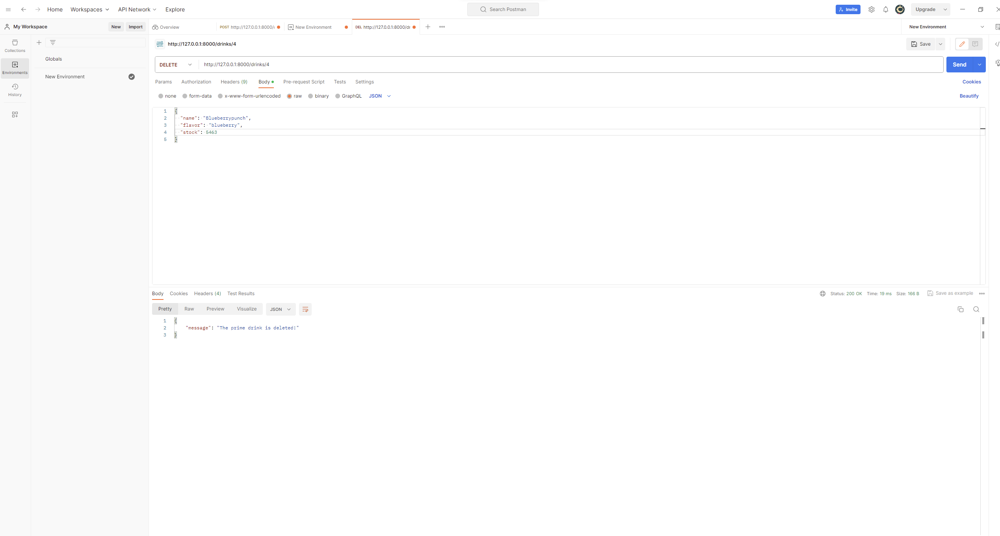
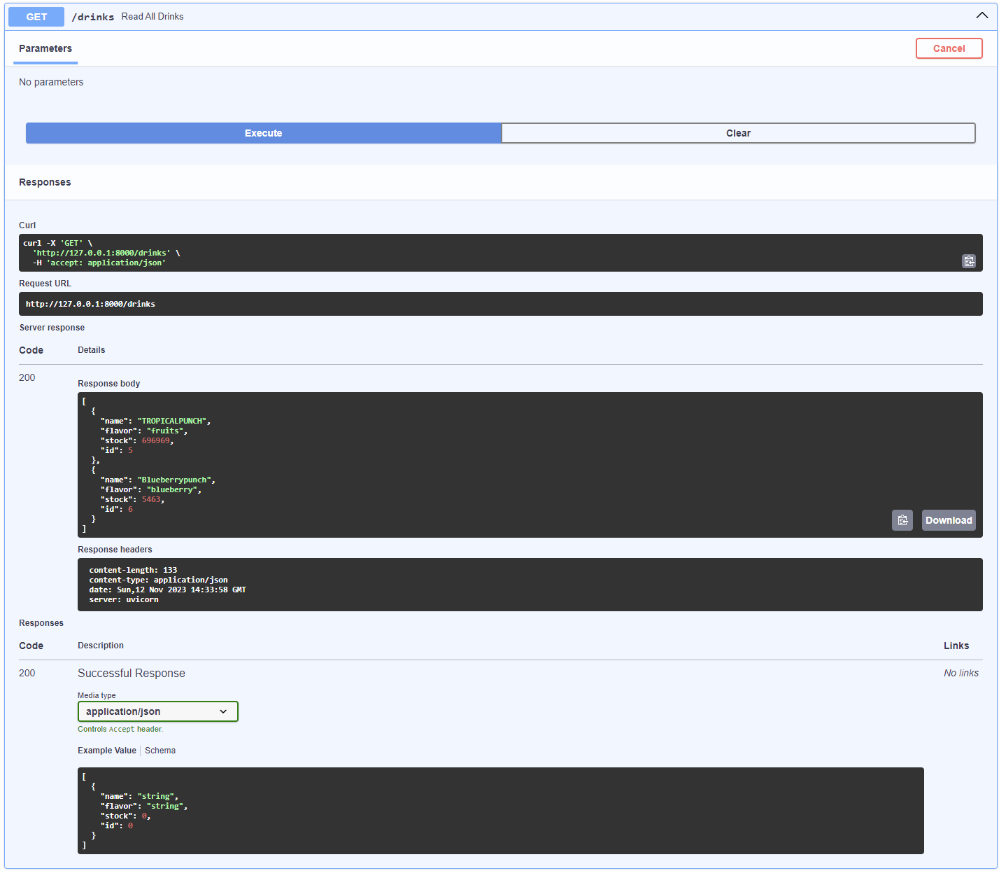
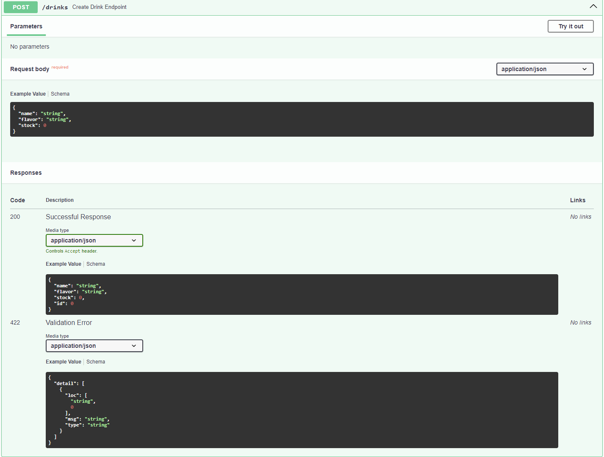
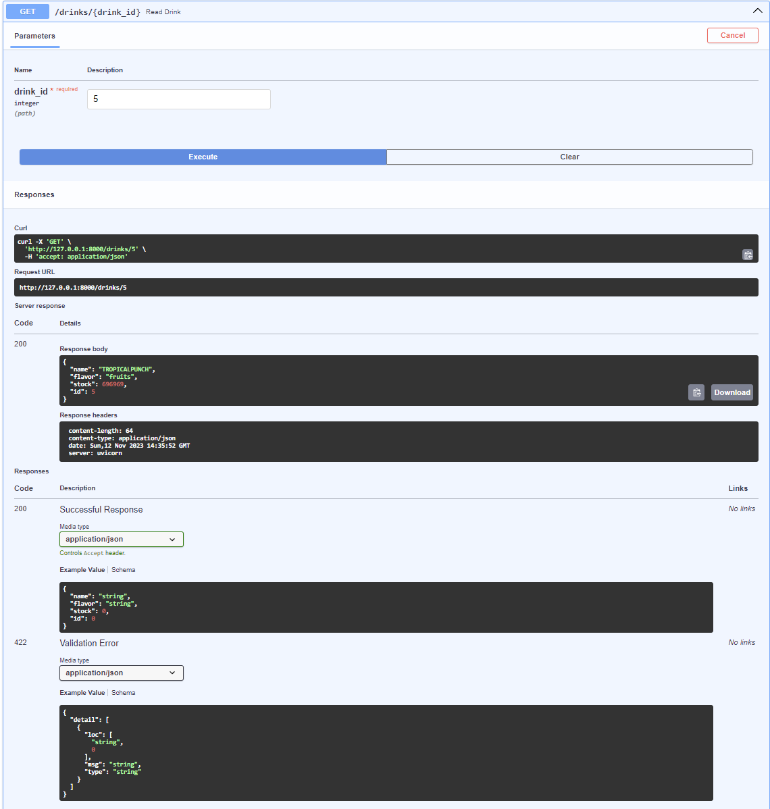
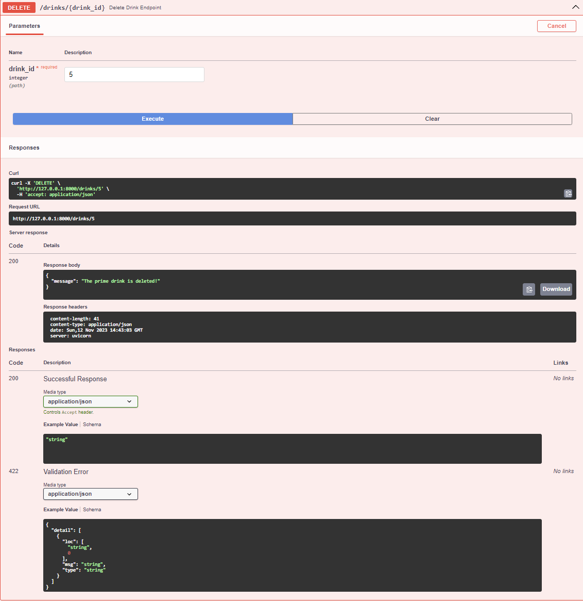

# APIproject
# Prime Drinks API

Deze API is ontworpen voor het beheren van informatie over Prime Drinks, inclusief hun smaken en huidige voorraad. Het biedt verschillende eindpunten om gegevens op te halen, te creëren, bij te werken en te verwijderen.

## Gehoste API

De API is gehost op [GitHub Pages](https://github.com/Swetsy/APIproject). Klik op de link om de API te verkennen en ermee te communiceren.
## API Demonstration

### GET Request - Retrieve All Drinks

### POST Request - Create a New Drink
[GET Request - Retrieve specific Drink](screenshots/specific_drink.png)

### GET Request - Retrieve All Drinks

### DELETE Request - Delete Drink

## OpenAPI Documentation

- 
- 
- 
- 